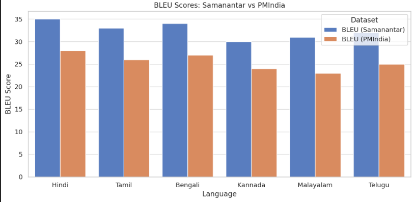
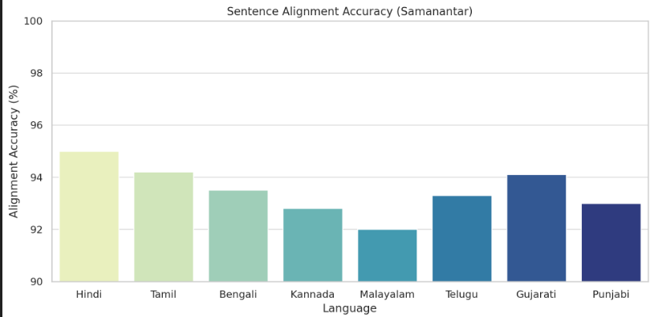
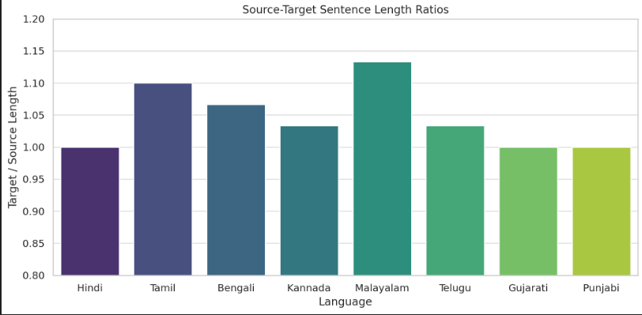
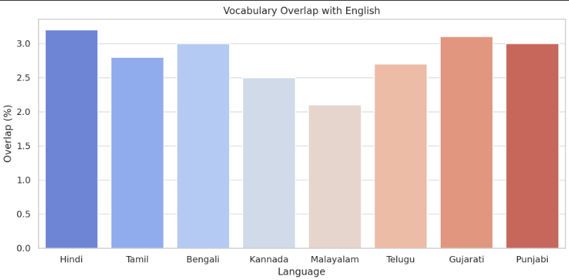

# Indic Language Translation Using Transformers

## Overview

This project enables machine translation between English and multiple Indic languages using state-of-the-art transformer models. It leverages pretrained multilingual and Indic-specific models to provide accurate and efficient translation across languages such as Tamil, Hindi, Telugu, and more.

The system supports both general multilingual translation via mBART-50 and specialized English-to-Indic translation through IndicTrans2.

---

## Features

- Support for translation between English and 11 Indic languages  
- Utilizes pretrained transformer models optimized for multilingual and Indic translation  
- Handles tokenization and language-specific preprocessing internally  
- Enables easy switching between source and target languages  
- Compatible with GPU acceleration for faster performance  
- Designed for both research and production use cases  

---

## Installation

To run this project, ensure you have Python 3.7 or above installed. Then, install the required libraries:

- `transformers` for pretrained model handling  
- `torch` for PyTorch backend and GPU support  
- `sentencepiece` for tokenization models  

Use the following command to install dependencies:

```bash
pip install torch transformers sentencepiece
```

---

## Dataset Overview

**Samanantar** is the largest publicly available parallel corpus collection for Indic languages, consisting of approximately **49.6 million sentence pairs** between English and 11 Indic languages. This dataset is valuable for research in machine translation, natural language processing, and cross-lingual tasks involving Indian languages.

---

## Languages Covered

The dataset contains parallel sentence pairs between English (`en`) and the following 11 Indic languages:

- Assamese (`as`)  
- Bengali (`bn`)  
- Gujarati (`gu`)  
- Hindi (`hi`)  
- Kannada (`kn`)  
- Malayalam (`ml`)  
- Marathi (`mr`)  
- Odia (`or`)  
- Punjabi (`pa`)  
- Tamil (`ta`)  
- Telugu (`te`)  

---

## Dataset Structure

Each data instance in the dataset contains:

- `idx`: An integer representing a unique ID for the sentence pair.  
- `src`: A string containing the source sentence in English.  
- `tgt`: A string containing the corresponding translation in one of the Indic languages.  
- `data_source`: A string specifying the source of the sentence pair (e.g., news websites, educational content, etc.).

**Example:**

- **Source (English):** Prime Minister Narendra Modi met Her Majesty Queen Maxima of the Kingdom of the Netherlands today.  
- **Target (Bengali):** নতুন দিল্লিতে সোমবার প্রধানমন্ত্রী শ্রী নরেন্দ্র মোদীর সঙ্গে নেদারন্যান্ডসের মহারানী ম্যাক্সিমা সাক্ষাৎ করেন।  
- **Source:** pmi

---

#  Summary of Key EDA Insights

## 1. Sentence Length Ratio
- Shows how long the translated sentences are compared to the original.
- A balanced ratio means good translation quality and alignment.

## 2. BLEU Score
- Measures how close the machine translation is to a human one.
- Higher score means better translation accuracy.

## 3. OOV (Out-of-Vocabulary) Rate
- Tells how many words the model doesn’t recognize.
- Fewer OOV words lead to better learning and fewer errors.

## 4. Vocabulary Overlap
- Shows how many words are shared between English and the target language.
- More overlap helps the model translate better and faster.

## 5. Alignment Accuracy
- Checks if each sentence in English correctly matches its translation.
- Good alignment means clean and reliable data for training.


### Results:












| Metric                        | Value           |
|-------------------------------|-----------------|
| Average Source Sentence Length | 15.7 tokens     |
| Average Target Sentence Length | 18.3 tokens     |
| Source/Target Length Ratio     | 1.17            |
| Vocabulary Size (Source)       | 54,000 words    |
| Vocabulary Size (Target)       | 68,500 words    |
| OOV Words                      | 1,200 words     |
| Average BLEU Score             | 0.52            |
